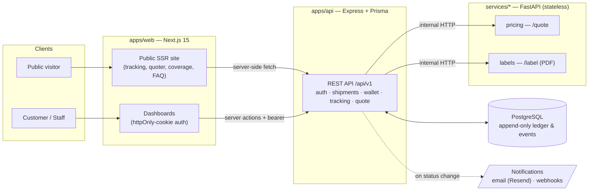
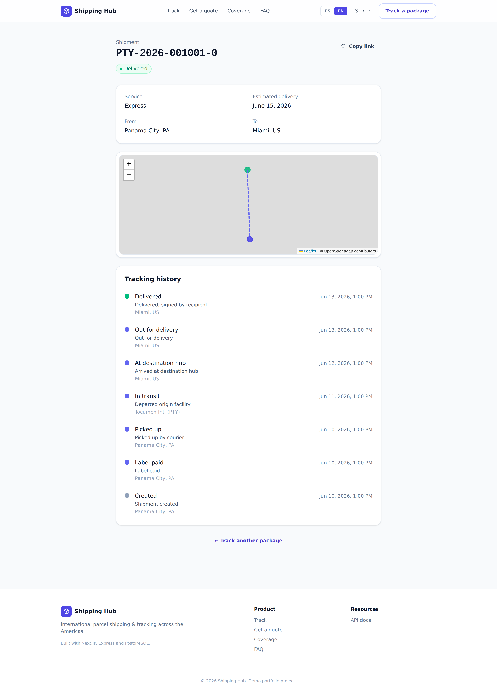
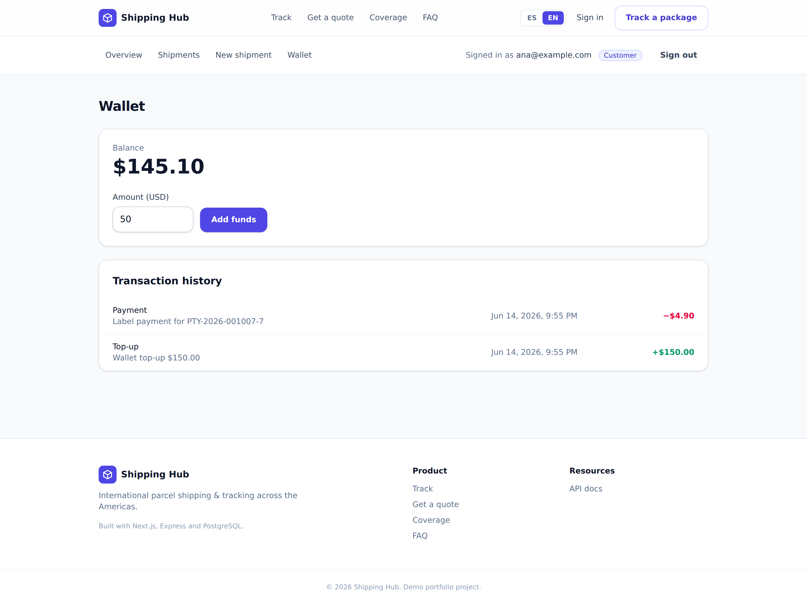
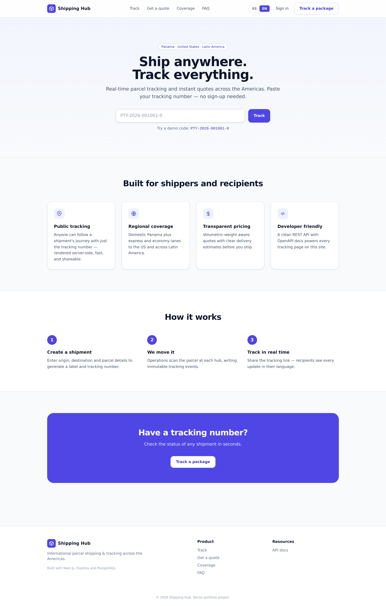
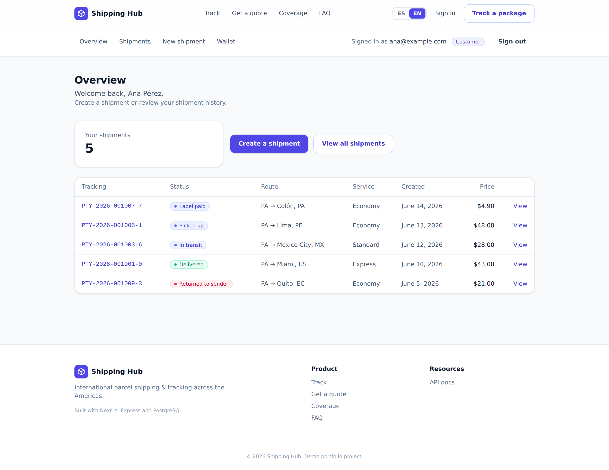
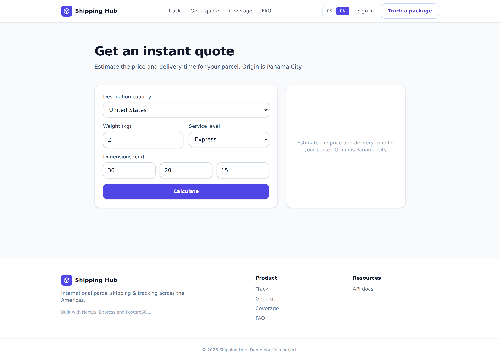
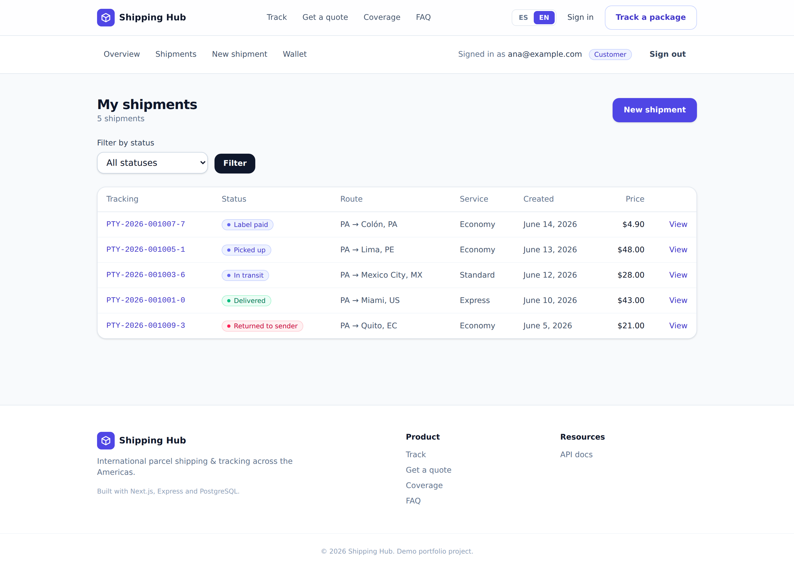

# Shipping Hub

International parcel shipping & tracking platform (UPS/FedEx style) with a bilingual
(es/en) public site. Anyone can track a package with its tracking number — no account
required — while registered users create shipments, pay for labels from a wallet, and
operations staff advance shipment states that feed the public timeline.

> Phased plan in [`ROADMAP.md`](./ROADMAP.md) · conventions in [`CLAUDE.md`](./CLAUDE.md).
> **Phases 0–6 are implemented.**

## Architecture



**Golden rule:** only `apps/api` touches PostgreSQL. The Python microservices are
stateless — they receive data, compute/generate, and return a result.

## Screenshots

| Public tracking (SSR + route map) | Wallet — double-entry ledger |
|---|---|
|  |  |
| **Landing** | **Customer dashboard** |
|  |  |
| **Quote calculator** | **Shipments** |
|  |  |

## Stack

| Area | Tech |
|---|---|
| Web (`apps/web`) | Next.js 15 (App Router), React 19, TypeScript, Tailwind v4, next-intl (es/en), Leaflet |
| API (`apps/api`) | Express 5, TypeScript, Prisma, PostgreSQL |
| Services (`services/*`) | FastAPI (pricing/ETA, PDF labels) |
| Shared (`packages/shared`) | Zod schemas, DTOs, enums, the shipment state machine, tracking-code (Luhn) |
| Tooling | pnpm workspaces, Turborepo, ESLint, Prettier, Vitest, GitHub Actions |

## Features by phase

- **1 — Transactional API**: JWT auth (access + rotating refresh tokens), roles
  (customer/courier/admin), shipment CRUD, append-only tracking events validated against a
  **state machine**, public **rate-limited** tracking, zone pricing + business-day ETAs, OpenAPI docs.
- **2 — Public web**: bilingual landing, **SSR tracking** with a `ParcelDelivery` JSON-LD timeline,
  quote calculator, coverage, FAQ. Full SEO (dynamic metadata, OG + dynamic OG images, hreflang,
  sitemap, robots).
- **3 — Dashboards**: cookie-based auth; customer shipment history + create wizard; staff
  shipment search + register-event (valid transitions only).
- **4 — Python microservices**: `pricing` (`POST /quote`) and `labels` (`POST /label`, 4×6 PDF with
  Code-128 barcode + QR), consumed by the API over internal HTTP; the public quoter uses live pricing.
- **5 — Payments**: per-user **wallet** backed by a **double-entry ledger** (balance is the sum of
  append-only entries), `idempotency_key` on every money movement (double-click safe), and automatic
  reversal on label-generation failure.
- **6 — Polish**: Leaflet route map on the tracking page, email (Resend) + outbound webhook
  notifications on status changes, container/Render deploy configs.

`PTY-YYYY-NNNNNN-C` tracking numbers carry a Luhn check digit.

## Getting started

```bash
pnpm install

# 1. PostgreSQL (user/pass/db: shipping / shipping / shipping_hub)
docker compose up -d

# 2. Migrate + seed demo data (10 shipments across every state)
pnpm --filter @shipping-hub/api db:deploy
pnpm --filter @shipping-hub/api db:seed

# 3. Run web (http://localhost:3000) + api (http://localhost:4000)
pnpm dev

# 4. (optional) the Python services
cd services/pricing && python3 -m venv .venv && . .venv/bin/activate && pip install -r requirements.txt && uvicorn main:app --port 8001
cd services/labels  && python3 -m venv .venv && . .venv/bin/activate && pip install -r requirements.txt && uvicorn main:app --port 8002
```

Demo accounts (password `Password123!`): `admin@shippinghub.test`,
`courier@shippinghub.test`, `ana@example.com`, `luis@example.com`.

```bash
curl http://localhost:4000/api/v1/tracking/PTY-2026-001001-0   # public, no auth
# or open http://localhost:3000/en/tracking/PTY-2026-001001-0
```

API reference: <http://localhost:4000/api/v1/docs>.

## Scripts

| Command | What it does |
|---|---|
| `pnpm dev` | Run web + api via Turborepo |
| `pnpm lint` / `pnpm typecheck` | ESLint / `tsc --noEmit` across the repo |
| `pnpm test` | Shared unit + API integration tests (needs PostgreSQL) |
| `pnpm --filter @shipping-hub/api db:migrate` | Create/apply a Prisma migration |

## Deploy

Container images: `apps/api/Dockerfile`, `apps/web/Dockerfile`, and `services/*/Dockerfile`
(build the Node images from the monorepo root, e.g. `docker build -f apps/api/Dockerfile .`).
[`render.yaml`](./render.yaml) is a one-click Render blueprint for the whole stack
(API + web + both Python services + PostgreSQL). Web also deploys cleanly to **Vercel**;
PostgreSQL to **Neon/Supabase**. Notification env vars (`RESEND_API_KEY`, `WEBHOOK_URL`, …)
are optional — see `apps/api/.env.example`.
