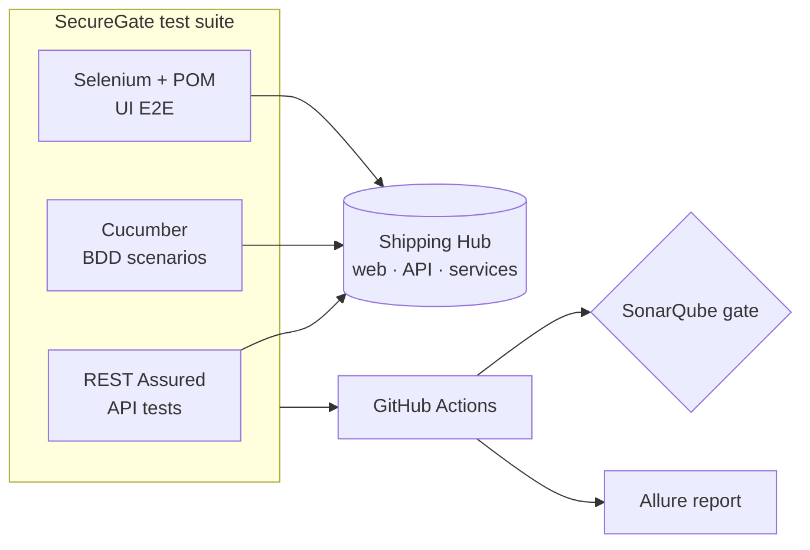

# SecureGate

**Automated QA & security test suite for [Shipping Hub](../FullStackHub)** — the full-stack parcel platform (live at <https://shipping-hub.up.railway.app/>). SecureGate tests it the way a QA Automation Engineer would: API, UI and BDD, in CI, behind a quality gate.

> **Status: Phases 0–6 implemented.** The full QA suite — **REST Assured API**, **Cucumber BDD**
> and **Selenium UI E2E** (43 tests) — runs against a local Shipping Hub with **Allure** reporting
> and a token-gated **SonarQube** step. The GitHub Actions pipeline stands up the API + web + Chrome
> and runs everything on every PR and nightly. See [`ROADMAP.md`](./ROADMAP.md); conventions in
> [`CLAUDE.md`](./CLAUDE.md).

## What it tests

The **Shipping Hub** platform (Next.js web + Express API + Python services + PostgreSQL) — through its public API and web UI only (**black-box**):

- **API** (REST Assured): tracking, quote, auth, shipments, wallet — contracts, validation, idempotency, and security negatives (rate limiting, authz, tampered JWT).
- **UI E2E** (Selenium + Page Object Model): the critical journeys in a real browser.
- **BDD** (Cucumber): those journeys as readable Gherkin specs.

## Architecture



## Stack

| Area | Tech |
|---|---|
| API testing | Java 21, REST Assured, JSON-schema validation |
| UI E2E | Selenium WebDriver, Page Object Model, WebDriverManager |
| BDD | Cucumber (Gherkin) |
| Runner / build | JUnit 5, Maven |
| Quality gate | SonarQube / SonarCloud, JaCoCo |
| Reporting | Allure |
| CI/CD | GitHub Actions |

## Getting started

SecureGate is black-box, so it needs a running Shipping Hub. Bring up a local instance, then run
the suite:

```bash
# 1. Start a local Shipping Hub (in ../FullStackHub)
docker compose up -d                          # PostgreSQL
pnpm --filter @shipping-hub/api db:deploy      # migrate
pnpm --filter @shipping-hub/api db:seed        # seed demo data
pnpm --filter @shipping-hub/api dev            # API on http://localhost:4000

# 2. Run the QA suite (in ./SecureGate)
./mvnw verify                                  # 28 REST Assured + 9 Cucumber tests
./mvnw allure:report                           # -> target/site/allure-maven-plugin

# UI E2E also needs the web app (pnpm --filter @shipping-hub/web dev) + a browser:
./mvnw verify -DexcludedGroups=ratelimit       # adds the 6 Selenium UI tests
```

CI does all of this automatically (API + web + Chrome) — see [`/.github/workflows/securegate-ci.yml`](../.github/workflows/securegate-ci.yml).

## What's covered

| Shipping Hub feature | API (REST Assured) | BDD (Cucumber) | UI (Selenium) |
|---|---|---|---|
| Public tracking | contract · 400 · 404 · 429 | ✅ | landing → result · not-found |
| Quote | contract · validation | ✅ | calculator → price |
| Auth (login/refresh/me) | + JWT/authz negatives | ✅ | sign-in · invalid-creds error |
| Shipments | CRUD · owner-scoped authz | — | — |
| Wallet | ledger · top-up · idempotency | top-up | — |
| Language (es/en) | — | — | header switch |

Each run produces an **Allure** report (REST Assured calls attached); CI uploads it as an artifact.

## Roadmap

Seven phases (0–6), from a smoke test to a full API + BDD + UI suite in CI with a quality gate and a published report — see [`ROADMAP.md`](./ROADMAP.md). The system under test is [`../FullStackHub`](../FullStackHub); the pipeline (a GitHub Actions workflow) will live at the repo root `/.github/workflows/securegate-ci.yml`.
