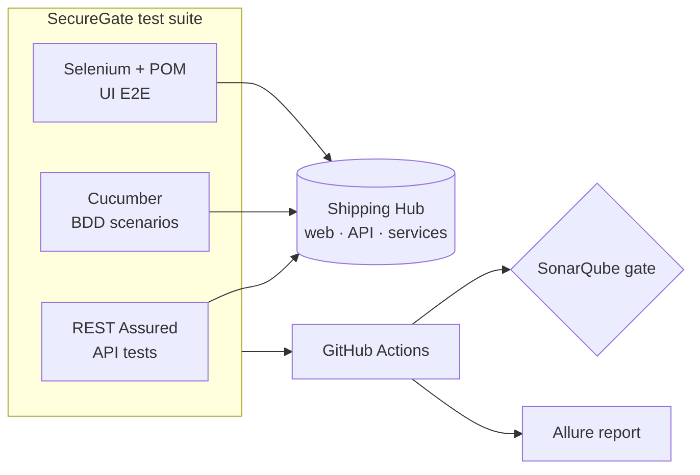

# SecureGate

**Automated QA & security test suite for [Shipping Hub](../FullStackHub)** — the full-stack parcel platform (live at <https://shipping-hub.up.railway.app/>). SecureGate tests it the way a QA Automation Engineer would: API, UI and BDD, in CI, behind a quality gate.

> **Status: roadmap stage.** Built phase by phase per [`ROADMAP.md`](./ROADMAP.md); the sections below describe the **target** suite. Conventions in [`CLAUDE.md`](./CLAUDE.md). Nothing here is implemented yet.

## What it tests

The **Shipping Hub** platform (Next.js web + Express API + Python services + PostgreSQL) — through its public API and web UI only (**black-box**):

- **API** (REST Assured): tracking, quote, auth, shipments, wallet — contracts, validation, idempotency, and security negatives (rate limiting, authz, tampered JWT).
- **UI E2E** (Selenium + Page Object Model): the critical journeys in a real browser.
- **BDD** (Cucumber): those journeys as readable Gherkin specs.

## Architecture



## Stack

| Area | Tech |
|---|---|
| API testing | Java 21, REST Assured, JSON-schema validation |
| UI E2E | Selenium WebDriver, Page Object Model, WebDriverManager |
| BDD | Cucumber (Gherkin) |
| Runner / build | JUnit 5, Maven |
| Quality gate | SonarQube / SonarCloud, JaCoCo |
| Reporting | Allure |
| CI/CD | GitHub Actions |

## Getting started (once Phase 0 lands)

```bash
./mvnw verify -Denv=live    # test the live Shipping Hub
./mvnw verify -Denv=local   # test a local Shipping Hub (bring ../FullStackHub up first)
```

## Roadmap

Seven phases (0–6), from a smoke test to a full API + BDD + UI suite in CI with a quality gate and a published report — see [`ROADMAP.md`](./ROADMAP.md). The system under test is [`../FullStackHub`](../FullStackHub); the pipeline (a GitHub Actions workflow) will live at the repo root `/.github/workflows/securegate-ci.yml`.
