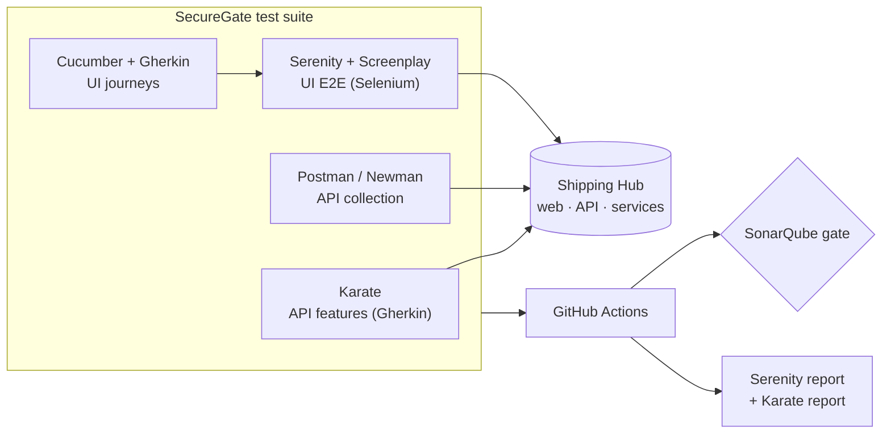

# SecureGate

**Automated QA & security test suite for [Shipping Hub](../FullStackHub)** — the full-stack parcel platform (live at <https://shipping-hub.up.railway.app/>). SecureGate tests it the way a QA Automation Engineer would: API, UI and BDD, in CI, behind a quality gate.

> **Modernized test stack.** The suite now runs on **Karate** (API, Gherkin-native), **Serenity BDD +
> Screenplay** over **Selenium** (UI E2E), **Cucumber/Gherkin** (journeys), and a **Postman/Newman**
> collection — all in Java 21 (OOP). The previous Page Object Model grew hard to maintain as the UI
> surface widened, so UI tests moved to the **Screenplay pattern** (Actors performing Tasks, asking
> Questions). Reporting is **Serenity**'s living documentation plus Karate's HTML report; the
> token-gated **SonarQube** gate stays. See [`ROADMAP.md`](./ROADMAP.md); conventions in
> [`CLAUDE.md`](./CLAUDE.md).

## What it tests

The **Shipping Hub** platform (Next.js web + Express API + Python services + PostgreSQL) — through its public API and web UI only (**black-box**):

- **API** (Karate): tracking, quote, auth, shipments, wallet — contracts (schema-style `match`), validation, idempotency, and security negatives (rate limiting, authz, tampered JWT).
- **UI E2E** (Serenity + Screenplay + Selenium): the critical journeys in a real browser, written as Actors performing Tasks.
- **BDD** (Cucumber + Gherkin): those journeys as readable specs that Serenity turns into living documentation.
- **Postman/Newman**: a hand-runnable, shareable collection of the same API checks.

## Architecture



## Stack

| Area | Tech |
|---|---|
| API testing | Java 21, **Karate** (Gherkin-native HTTP + `match` contracts) |
| API collection | **Postman** collection + **Newman** (headless) |
| UI E2E | **Selenium** WebDriver via **Serenity Screenplay** (Tasks/Questions — replaces Page Object Model) |
| BDD | **Cucumber** (Gherkin), integrated with Serenity |
| Runner / build | JUnit 5, Maven |
| Quality gate | SonarQube / SonarCloud |
| Reporting | **Serenity** living documentation + Karate HTML report |
| CI/CD | GitHub Actions |

## Getting started

SecureGate is black-box, so it needs a running Shipping Hub. Bring up a local instance, then run
the suite:

```bash
# 1. Start a local Shipping Hub (in ../FullStackHub)
docker compose up -d                           # PostgreSQL
pnpm --filter @shipping-hub/api db:deploy       # migrate
pnpm --filter @shipping-hub/api db:seed         # seed demo data
pnpm --filter @shipping-hub/api dev             # API on http://localhost:4000

# 2. Run the API suite (Karate) (in ./SecureGate)
./mvnw verify                                   # 28 Karate API scenarios

# 3. Add the UI E2E suite (Serenity/Screenplay) — needs the web app + a browser:
pnpm --filter @shipping-hub/web dev             # web on http://localhost:3000
./mvnw verify -Pui                              # adds the 6 Serenity UI scenarios

# Run the UI tests without a window (CI / headless machines):
./mvnw verify -Pui -Dheadless.mode=true
```

> **The browser is visible by default.** The Serenity UI tests open a real Chrome window so you can
> watch each actor replay its scripted actions. You need a local Chrome installed — Selenium Manager
> downloads the matching driver automatically. On CI or any machine without a display, opt into
> headless with `-Dheadless.mode=true`.

> **Tests skipped with a "Shipping Hub is not reachable" message?** That means the stack isn't
> running — every `com.securegate` test is black-box and talks to it over HTTP, so the whole suite is
> cleanly **skipped** (not failed) when nothing is on `http://localhost:4000`. On Windows you can
> bring the whole stack up (Postgres + pricing/labels + API + web) and run the suite in one command:
>
> ```powershell
> pwsh scripts\run-local-stack.ps1 -RunTests
> ```

### Reports

```bash
./mvnw verify -Pui            # runs the suite
./mvnw serenity:aggregate     # -> target/site/serenity/index.html  (UI living documentation)
# Karate writes its report automatically -> target/karate-reports/karate-summary.html
```

### The Postman collection

```bash
cd postman
npx newman run SecureGate.postman_collection.json -e SecureGate.local.postman_environment.json
```

See [`postman/README.md`](./postman/README.md).

### Running from IntelliJ (or any IDE)

Every `com.securegate` test is an **integration** test against a running Shipping Hub, so two things
are worth knowing:

1. **The stack auto-starts — green-arrow just works.** Before any test touches the API, the suite
   runs a one-shot readiness check, and if the local Shipping Hub is **down it starts it for you**
   (runs [`scripts/run-local-stack.ps1`](scripts/run-local-stack.ps1) and waits until the API, its
   database, and the web app are up). The check is **database-aware**: it probes a real data read (the
   seeded demo tracking code), not just `/health`. Auto-start is local-only (`-Denv=local`, Windows,
   never in CI) and can be turned off with **`-Dsg.autostart=false`** — in which case a down stack
   falls back to cleanly **skipping** every test with one actionable message. Live bring-up progress
   is written to `SecureGate/target/local-stack-autostart.log`.
2. **The UI suite is opt-in.** `./mvnw verify` runs only the Karate API suite. Add `-Pui` to run the
   Serenity/Screenplay UI scenarios (they need the web app on `:3000` + a browser). Karate runners
   are also available per-feature in the IDE via `ApiFeatureRunners` (green-arrow a single feature).

Two committed run configurations (under [`.run/`](../.run), so they survive reopening the IDE) help:

- **SecureGate · start local stack** — brings Postgres + API + web up and waits for health.
- **SecureGate · verify (needs local stack)** — runs `mvnw verify -Pui` (the full suite).

### Running everything

```powershell
# Full suite: 28 Karate API + 6 Serenity UI scenarios (stack up: Postgres + API + web + Chrome)
./mvnw verify -Pui

# the opt-in rate-limit check (load-style; consumes the per-IP budget, so it runs on its own)
./mvnw verify "-Dtest=ApiKarateTest" -Dsg.ratelimit=true
```

CI does all of this automatically (API + web + Chrome) — see [`/.github/workflows/securegate-ci.yml`](../.github/workflows/securegate-ci.yml).

## What's covered

| Shipping Hub feature | API (Karate) | UI (Serenity/Screenplay) |
|---|---|---|
| Public tracking | contract · 400 · 404 · 429 | landing → result · not-found |
| Quote | contract · validation | calculator → price |
| Auth (login/refresh/me) | + JWT/authz negatives | sign-in · invalid-creds error |
| Shipments | CRUD · owner-scoped authz | — |
| Wallet | ledger · top-up · idempotency | — |
| Language (es/en) | — | header switch |

Each run produces a **Serenity** report (UI journeys, with screenshots on failure) and a **Karate**
HTML report (every API call attached); CI uploads both as artifacts.

## Roadmap

Seven phases (0–6), from a smoke test to a full Karate API + Serenity/Screenplay UI suite in CI with
a quality gate and published reports — see [`ROADMAP.md`](./ROADMAP.md). The system under test is
[`../FullStackHub`](../FullStackHub); the pipeline (a GitHub Actions workflow) lives at the repo root
`/.github/workflows/securegate-ci.yml`.
