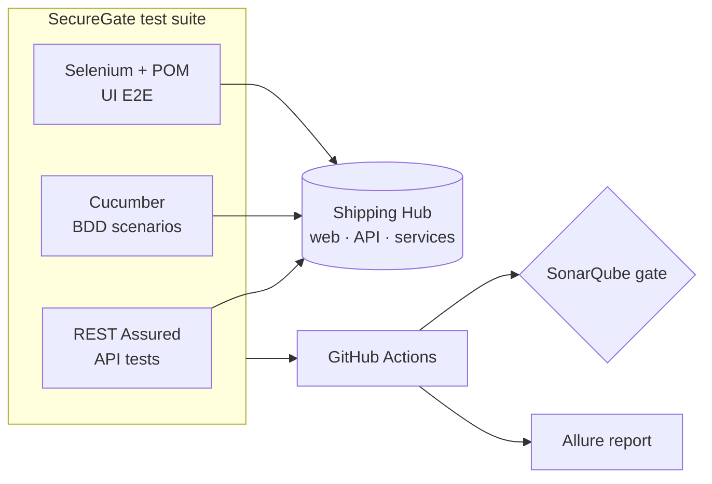

# SecureGate

**Automated QA & security test suite for [Shipping Hub](../FullStackHub)** — the full-stack parcel platform (live at <https://shipping-hub.up.railway.app/>). SecureGate tests it the way a QA Automation Engineer would: API, UI and BDD, in CI, behind a quality gate.

> **Status: Phases 0–6 implemented.** The full QA suite — **REST Assured API**, **Cucumber BDD**
> and **Selenium UI E2E** (43 tests) — runs against a local Shipping Hub with **Allure** reporting
> and a token-gated **SonarQube** step. The GitHub Actions pipeline stands up the API + web + Chrome
> and runs everything on every PR and nightly. See [`ROADMAP.md`](./ROADMAP.md); conventions in
> [`CLAUDE.md`](./CLAUDE.md).

## What it tests

The **Shipping Hub** platform (Next.js web + Express API + Python services + PostgreSQL) — through its public API and web UI only (**black-box**):

- **API** (REST Assured): tracking, quote, auth, shipments, wallet — contracts, validation, idempotency, and security negatives (rate limiting, authz, tampered JWT).
- **UI E2E** (Selenium + Page Object Model): the critical journeys in a real browser.
- **BDD** (Cucumber): those journeys as readable Gherkin specs.

## Architecture



## Stack

| Area | Tech |
|---|---|
| API testing | Java 21, REST Assured, JSON-schema validation |
| UI E2E | Selenium WebDriver, Page Object Model, WebDriverManager |
| BDD | Cucumber (Gherkin) |
| Runner / build | JUnit 5, Maven |
| Quality gate | SonarQube / SonarCloud, JaCoCo |
| Reporting | Allure |
| CI/CD | GitHub Actions |

## Getting started

SecureGate is black-box, so it needs a running Shipping Hub. Bring up a local instance, then run
the suite:

```bash
# 1. Start a local Shipping Hub (in ../FullStackHub)
docker compose up -d                          # PostgreSQL
pnpm --filter @shipping-hub/api db:deploy      # migrate
pnpm --filter @shipping-hub/api db:seed        # seed demo data
pnpm --filter @shipping-hub/api dev            # API on http://localhost:4000

# 2. Run the QA suite (in ./SecureGate)
./mvnw verify                                  # 28 REST Assured + 9 Cucumber tests
./mvnw allure:report                           # -> target/site/allure-maven-plugin

# UI E2E also needs the web app (pnpm --filter @shipping-hub/web dev) + a browser:
./mvnw verify -DexcludedGroups=ratelimit       # adds the 6 Selenium UI tests

# Run the Selenium tests without a window (CI / headless machines):
./mvnw verify -DexcludedGroups=ratelimit -Dheadless=true
```

> **The browser is now visible by default.** The Selenium tests open a real Chrome window so you can
> watch each test replay its scripted actions. You need a local Chrome installed — Selenium Manager
> downloads the matching driver automatically. On CI or any machine without a display, opt back into
> headless with `-Dheadless=true` (or set `HEADLESS=true`).

> **Tests failing with `java.net.ConnectException: Connection refused`?** That means the Shipping Hub
> isn't running — every `com.securegate` test is black-box and talks to it over HTTP, so the whole
> suite "fails" when nothing is listening on `http://localhost:4000`. On Windows you can bring the
> whole stack up (Postgres + pricing/labels + API + web) and run the suite in one command:
>
> ```powershell
> pwsh scripts\run-local-stack.ps1 -RunTests
> ```

### Running from IntelliJ (or any IDE)

Every `com.securegate` test is an **integration** test against a running Shipping Hub, so two IDE
gotchas used to bite if you just green-arrow the `com.securegate` folder:

1. **The stack auto-starts — green-arrow just works.** Before any test touches the API, the suite
   runs a one-shot readiness check, and if the local Shipping Hub is **down it starts it for you**
   (runs [`scripts/run-local-stack.ps1`](scripts/run-local-stack.ps1) and waits until the API, its
   database, and the web app are up). The first test then blocks for ~1 minute while the stack comes
   up; everything after is instant. No more "all tests skipped because nothing is on `:4000`". The
   check is **database-aware**: it probes a real data read (the seeded demo tracking code), not just
   `/health` (which touches no DB), so an API that is up but whose PostgreSQL has crashed is treated
   as down and the stack is brought back. Auto-start is local-only (`-Denv=local`, Windows, never in
   CI) and can be turned off with **`-Dsg.autostart=false`** — in which case a down stack falls back
   to the old behavior: every test is cleanly **skipped** (not failed) with one message telling you to
   start the stack by hand. Live bring-up progress is written to
   `SecureGate/target/local-stack-autostart.log`.
2. **The IDE's JUnit runner ignores Maven's group exclusions** (`ratelimit`, `ui`), so running the
   folder directly also fires the Selenium UI tests (need a browser) and the slow `RateLimitIT`.
   Prefer running through Maven so the exclusions apply.

You no longer need to start anything first — but two committed run configurations (under
[`.run/`](../.run), so they survive reopening the IDE) are still handy:

- **SecureGate · start local stack** — brings Postgres + API + web up and waits for health.
- **SecureGate · verify (needs local stack)** — runs `mvnw verify` (honoring the group exclusions).

Or do everything at once from a terminal:
`powershell -ExecutionPolicy Bypass -File SecureGate\scripts\run-local-stack.ps1 -RunTests`.

### Running the complete suite (all 44 tests)

The default `mvnw verify` excludes two tag groups (`ratelimit`, `ui`). To run **everything**, with the
stack up (Postgres + API + web + Chrome):

```powershell
# 43 tests: API + BDD + the 6 Selenium UI tests
./mvnw verify -DexcludedGroups=ratelimit

# the 44th test (load-style; consumes the per-IP rate-limit budget, so it runs on its own)
./mvnw verify "-Dit.test=RateLimitIT" "-DexcludedGroups=."
```

> **Verified in a clean Windows sandbox (June 2026):** with the bundled Node 22 + PostgreSQL under
> `%USERPROFILE%\sg-tools` and a local Chrome, **all 44 tests pass** — even without Python installed.
> The `pricing`/`labels` microservices are *optional*: the API computes quotes locally (identical
> result) when `pricing` is down, and the suite never downloads a label. The only caveat is that the
> first UI run against a freshly-started `next dev` can time out while Next.js compiles routes on
> demand; `run-local-stack.ps1` now pre-warms those routes so the UI tests are deterministic.

CI does all of this automatically (API + web + Chrome) — see [`/.github/workflows/securegate-ci.yml`](../.github/workflows/securegate-ci.yml).

## What's covered

| Shipping Hub feature | API (REST Assured) | BDD (Cucumber) | UI (Selenium) |
|---|---|---|---|
| Public tracking | contract · 400 · 404 · 429 | ✅ | landing → result · not-found |
| Quote | contract · validation | ✅ | calculator → price |
| Auth (login/refresh/me) | + JWT/authz negatives | ✅ | sign-in · invalid-creds error |
| Shipments | CRUD · owner-scoped authz | — | — |
| Wallet | ledger · top-up · idempotency | top-up | — |
| Language (es/en) | — | — | header switch |

Each run produces an **Allure** report (REST Assured calls attached); CI uploads it as an artifact.

## Roadmap

Seven phases (0–6), from a smoke test to a full API + BDD + UI suite in CI with a quality gate and a published report — see [`ROADMAP.md`](./ROADMAP.md). The system under test is [`../FullStackHub`](../FullStackHub); the pipeline (a GitHub Actions workflow) will live at the repo root `/.github/workflows/securegate-ci.yml`.
