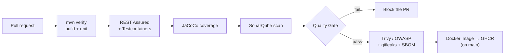

# SecureGate

**DevSecOps CI/CD security pipeline** gating a small Java (Spring Boot) microservices backend. Every change must pass automated **security & quality gates** before it ships.

> **Status: roadmap stage.** The system is being built phase by phase per [`ROADMAP.md`](./ROADMAP.md); the sections below describe the **target** architecture. Conventions in [`CLAUDE.md`](./CLAUDE.md). Nothing here is implemented yet.

## What it is

SecureGate demonstrates *shift-left* DevSecOps. A compact backend — an `auth-service` (accounts + JWT) and a `vault-service` (an API-key vault with role-based access) — sits behind a **GitHub Actions pipeline** whose gates catch vulnerabilities, broken API contracts, coverage regressions, vulnerable dependencies and leaked secrets **in CI, not in production**.

## Architecture (target)



## Stack

| Area | Tech |
|---|---|
| Services | Java 21, Spring Boot 3, Spring Data JPA, Flyway |
| Persistence | PostgreSQL (Docker Compose) |
| Testing | JUnit 5, REST Assured, Testcontainers |
| Quality/security gate | SonarQube / SonarCloud, JaCoCo |
| Supply chain | Trivy / OWASP Dependency-Check, gitleaks, CycloneDX SBOM |
| CI/CD | GitHub Actions → GHCR |
| Packaging | Docker (multi-stage, non-root) |

## Backend (target)

- **auth-service:** `POST /auth/register`, `POST /auth/login` (returns a JWT), `GET /auth/me`.
- **vault-service** (JWT-protected): `POST /keys`, `GET /keys`, `POST /keys/{id}/rotate`, `DELETE /keys/{id}`. Owner-scoped RBAC; secrets are hashed and shown only once.

## Getting started (once Phase 0 lands)

```bash
docker compose up -d        # PostgreSQL + both services
./mvnw verify               # build + unit + REST Assured integration tests
```

## Roadmap

Seven phases (0–6), from foundations to a hardened, badge-covered pipeline — see [`ROADMAP.md`](./ROADMAP.md). Progress is tracked there; the pipeline (a GitHub Actions workflow) will live at the repo root `/.github/workflows/securegate-ci.yml`, since GitHub only runs workflows from there.
